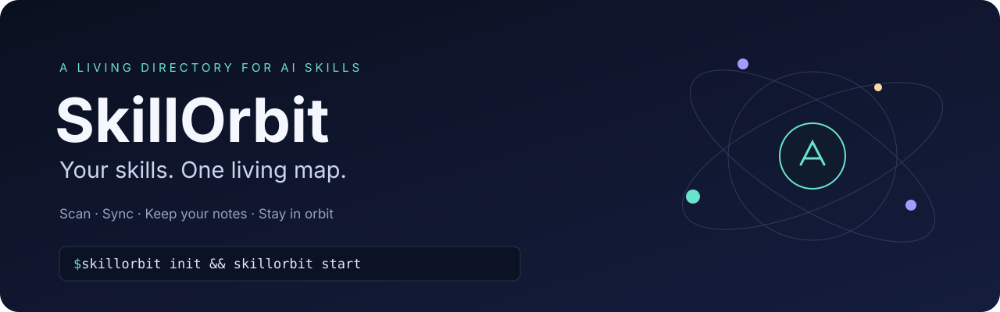

<p align="center">
  
</p>

<p align="center">
  <strong>SkillOrbit · 技能星图</strong><br>
  让项目里的 AI skills，始终有一份清晰、鲜活的目录。
</p>

<p align="center">
  <a href="LICENSE"></a>
  
  
  
</p>

<p align="center">
  中文 · <a href="README_EN.md">English</a> · <a href="#快速开始">快速开始</a> · <a href="docs/configuration.md">配置参考</a> · <a href="examples/demo/SKILLS.md">查看示例</a>
</p>

安装了越来越多 skills，却记不住名字、用途和来源？SkillOrbit 将当前项目的 `SKILL.md` 整理成四列 Markdown 目录，随文件增加、删除或修改自动同步。你只需要读目录、选 skill，在备注里记录自己的使用心得。

```text
.agents/skills/                       SKILLS.md
├── paper-reader/SKILL.md       ──▶   名称 · 归属 · 一句话描述 · 备注
├── figure-maker/SKILL.md              ↓
└── …                                 随增删自动同步，手写备注保留
```

| Skill 名称 | 归属项目 | 一句话描述 | 备注 |
|---|---|---|---|
| `paper-reader` | Research Kit | 制作来源可追溯的论文精读稿。 | 组会前常用 |
| `figure-maker` | Research Kit | 将实验数据绘制为投稿图表。 | 优先用于多面板图 |
| `review-loop` | Review Lab | 迭代评审研究方案并修正关键问题。 | 调用前准备实验结果 |

上表是产品示例；[可运行示例](examples/demo)包含独立的演示 skill。

## 恰好够用的功能

| 能力 | 使用价值 |
|---|---|
| 自动同步 | skill 增加、删除、重命名或描述变化后，目录自动更新。 |
| 备注保留 | 直接编辑 Markdown 的备注列；下一轮同步保留修改。 |
| 删除记忆 | 移除的 skill 从目录消失；同一名称和归属重新出现时恢复备注。 |
| 重复归并 | 同项目同名的多个版本合并为一行，展开来源索引仍可看到每份定义。 |
| 项目归属 | 优先应用显式配置，再读取元数据或本地 Git origin；未知来源明确标为未归属。 |
| 可追溯描述 | 从 `description` 提取首句；可导入现有人工简介，源描述改变后自动刷新。 |
| 安静写入 | 内容不变时不改写目录；使用原子替换和进程锁协调同步。 |
| 本地运行 | 无模型 API、无账户、无上传流程；仅依赖 PyYAML。 |

## 快速开始

需要 **Python 3.10+**。从 GitHub 安装：

```bash
python3 -m venv ~/.venvs/skillorbit
~/.venvs/skillorbit/bin/python -m pip install "git+https://github.com/GitHubbirdfjh/skill-orbit.git"

cd /path/to/your-project
~/.venvs/skillorbit/bin/skillorbit init
~/.venvs/skillorbit/bin/skillorbit start
```

如果没有 Git，先从 GitHub 的 **Code → Download ZIP** 下载并解压，在解压目录中执行 `python -m pip install .`。也可使用已安装的 pipx：

```bash
pipx install "git+https://github.com/GitHubbirdfjh/skill-orbit.git"
cd /path/to/your-project
skillorbit init
skillorbit start
```

默认读取当前项目的 `.agents/skills/`，生成 `SKILLS.md`，每 **2 秒**检查变化。下文假定 `skillorbit` 已在 PATH；否则使用上述虚拟环境中的完整命令路径。

Windows 虚拟环境命令位于 `.venv\Scripts\`。扫描、同步和后台运行的实现兼容 macOS、Linux、Windows；仓库 CI 配置覆盖三种系统，实际 CI 状态以 Actions 为准。

### 迁移已有目录

你已经写好的名称、归属、中文简介和备注可以继续使用：

```bash
skillorbit init --import-md skills目录.md --output skills目录.md
skillorbit start
```

同文件迁移前会保存 `skills目录.md.pre-skillorbit.bak`。导入要求表格前三列依次为**名称、归属、描述**，名称写为反引号包围的 `` `skill-name` ``，可选第四列为备注。源 skill 描述变化后，导入的旧简介会失效并回到源描述首句；新 skill 也直接读取自己的描述语言。

### 日常操作

```bash
skillorbit list 论文                       # 搜索名称、归属和描述
skillorbit note paper-reader "组会前常用"   # 写备注，也可以直接编辑 MD
skillorbit sync                            # 立即同步
skillorbit status                          # 检查后台进程
skillorbit stop                            # 停止后台进程
```

在 Codex、Claude 或其他支持项目 skills 的助手中，直接写明技能名和任务即可，例如：“使用 `paper-reader` 解读这篇论文”。SkillOrbit 提供目录，不决定助手的技能发现机制。

### 让同步跨越重启

`start` 在本次登录期间后台运行。macOS 可启用原生登录服务：

```bash
skillorbit service install
skillorbit status
```

登录服务会绑定当前 Python 环境和项目路径，并在下次登录时启动。移动项目或删除虚拟环境后，需要重新安装服务。移除登录自启：`skillorbit service uninstall`。Linux/Windows 可把 `skillorbit watch` 接入自己的用户服务或任务计划程序。

## 灵活适配你的项目

同时管理多个本地技能目录：

```bash
skillorbit init --root .agents/skills --root .claude/skills --output docs/SKILLS.md
```

项目根目录的 `.skillorbit.json` 保存可读的配置。给同一套 skills 指定共同归属：

```json
{
  "version": 1,
  "roots": [".agents/skills"],
  "output": "SKILLS.md",
  "interval": 2,
  "project_rules": [
    {"match": ".agents/skills/nature-*/*", "project": "Nature Skills"},
    {"match": ".agents/skills/skills-codex*/*", "project": "ARIS"}
  ],
  "descriptions": {}
}
```

规则按顺序匹配，第一条命中的规则生效。也可在 skill frontmatter 中写 `project: Research Kit` 或 `metadata.project`；未命中配置时会读取它们。完整规则、持久状态与错误处理见[配置参考](docs/configuration.md)。

## 目录始终由你掌控

生成区使用 `<!-- skillorbit:begin -->` 和 `<!-- skillorbit:end -->` 两个标记。标记之外的说明、链接和使用指南会保留；标记内的**备注列**会被读取并保存，其余列由扫描结果更新。

`.skillorbit/state.json` 保存备注、来源及最近 100 次变更记录。删除它会丢失已移除 skills 的备注记忆；当前表格中的备注仍可重新读取。建议把配置和 Markdown 目录纳入版本控制，运行状态加入 `.gitignore`。

```gitignore
.skillorbit/
```

skill YAML 暂时无效、文件读失败或目录正在编辑时，保留最后一份成功目录，记录原因并等待下一次扫描。目录或扫描根被删除则视为正常移除，目录同步变空；移到项目外的符号链接不会被扫描。

## 开发与质量检查

```bash
python -m pip install -e .
python -m unittest discover -s tests -v
skillorbit --project examples/demo sync --check
```

测试覆盖增删及恢复、备注编辑与清空、同名不同项目、同名副本、YAML 错误、描述更新、无变化写入、旧清单迁移、特殊字符和实时监控。`sync --check` 返回 `0` 表示目录最新，`1` 表示需同步，`2` 表示输入或配置有错误。

**License: [MIT](LICENSE)** · Python + PyYAML · 面向每个装了太多 skills 的人。
